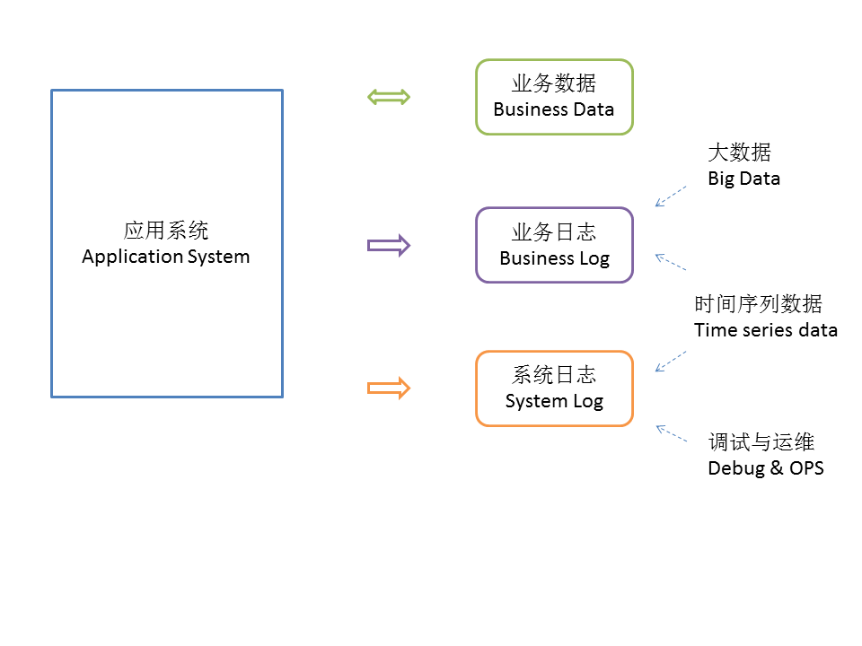
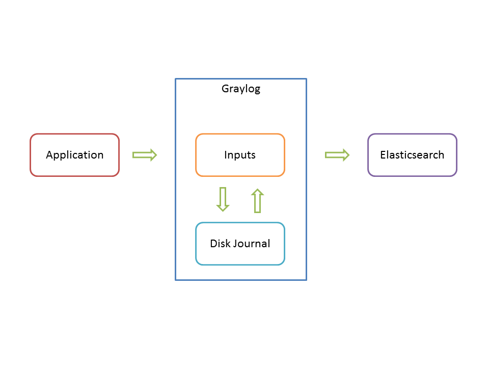
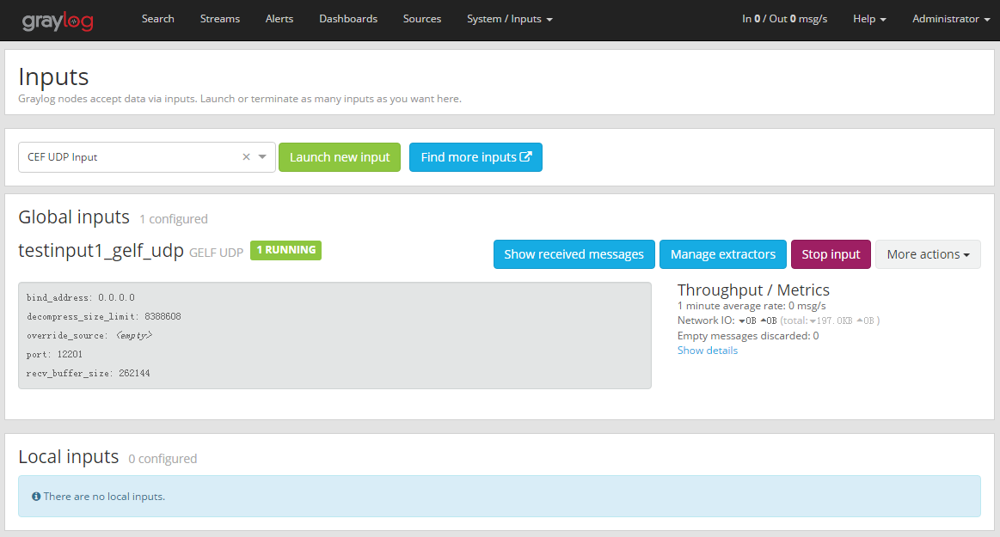
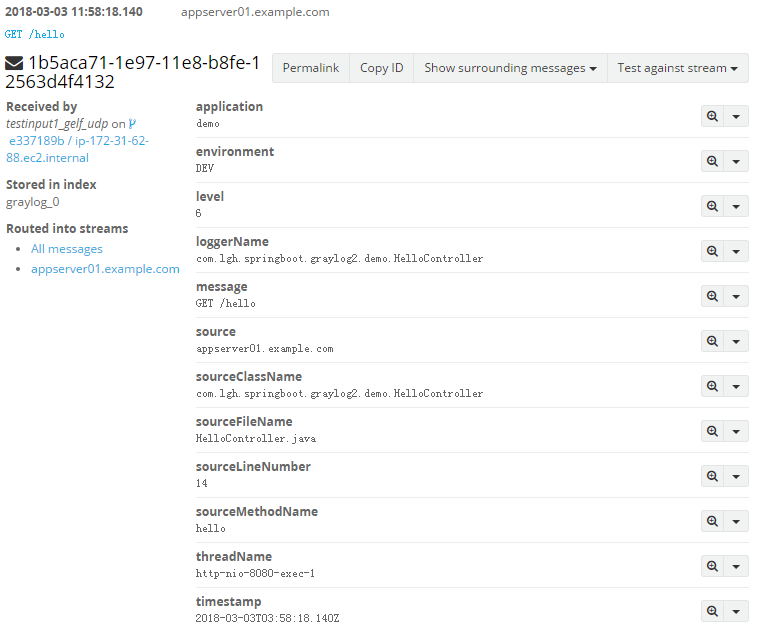
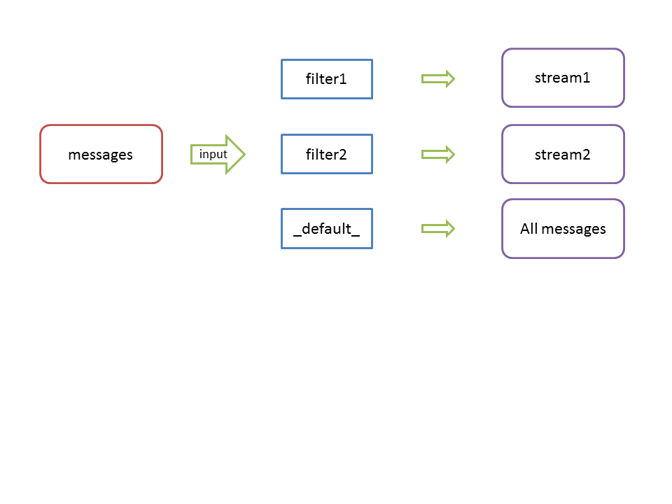
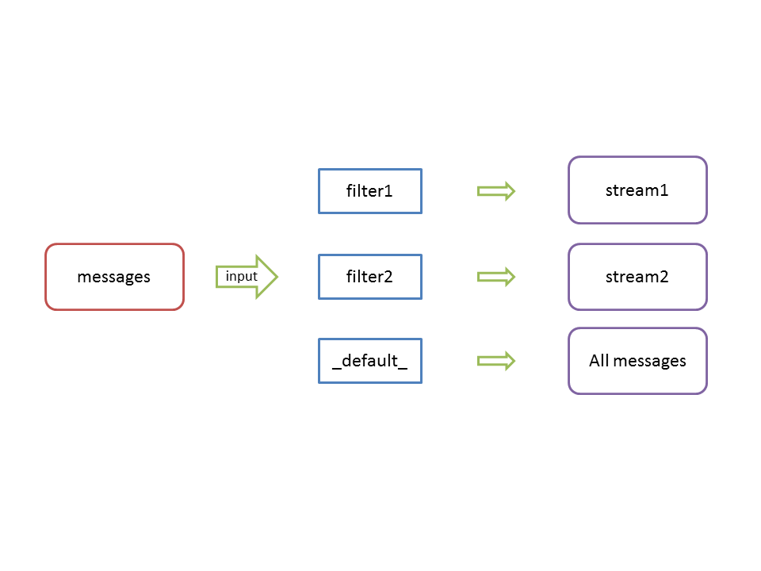

@title[Title]
## <span class="gold">Graylog</span>
##### Enterprise Log Management 

---

@title[Outline]
#### Outline
- Introduction |
- Architecture |
- Data Ingesting |
- Input Definitions|
- Streams |
- Dashboards |
- Streams |
- Search |
- Alerts |

---

@title[Introduction1]
#### Application Data Types


---

@title[Introduction2]
#### Graylog is a <span class="gold">centralized logging system</span>
- Storing
- Exploration
- Alerting
- Reporting
<br/>
<span class="aside">and more...</span>

---

@title[Architecture]
#### Components
- <span class="gold">MongoDB</span>: storing meta information and configuration data
- <span class="gold">Elasticsearch</span>: storing log data
- <span class="gold">Graylog-Server</span>: input/output/processing/Web UI

+++

@title[Small Setup]
<span style="color:gray; font-size:0.7em">Small setup</span>
<br/>


+++

@title[Multi-node Setup]
<span style="color:gray; font-size:0.7em">Multi-node setup</span>
<br/>


---

@title[Data Ingesting]
#### Data Ingesting
#### <span class="gold">Inputs</span>

<span class="aside">Define the input endpoints</span>

+++ 

<span style="color:gray; font-size:0.7em">Graylog inputs</span>


+++ 


#### Data Ingesting Methods
- Formats: Raw/Plaintext, Syslog, CEF, GELF, ...
- Transport methods: TCP, UDP, Kafka, AMQP, ...

+++

#### [<span class="gold">GELF</span>](http://docs.graylog.org/en/2.4/pages/gelf.html) (<span class="gold">G</span>raylog <span class="gold">E</span>xtended <span class="gold">L</span>og <span class="gold">F</span>ormat) is a log format.
- Structured
- Chunking
- Compression (GZIP/GLIB)

+++

<p><span class="menu-title slide-title">GELF message</span></p>
```javascript
{
  "version": "1.1",
  "host": "example.org",
  "short_message": "A short message that helps you identify what is going on",
  "full_message": "Backtrace here\n\nmore stuff",
  "timestamp": 1385053862.3072,
  "level": 1,
  "_user_id": 9001,
  "_some_info": "foo",
  "_some_env_var": "bar"
}
```

+++

#### <span class="gold">GELF</span> + <span class="gold">UDP</span>
#### <span class="gold">UDP</span> is not reliable, but it is <span class="gold">non-blocked</span>.
<span class="aside">We will put the application and the graylog on the same LAN</span>

+++

<p><span class="menu-title slide-title">pom.xml</span></p>
```xml
    <dependencies>
        <dependency>
            <groupId>org.springframework.boot</groupId>
            <artifactId>spring-boot-starter</artifactId>
            <exclusions>
                <exclusion>
                    <groupId>org.springframework.boot</groupId>
                    <artifactId>spring-boot-starter-logging</artifactId>
                </exclusion>
            </exclusions>
        </dependency>
        <dependency>
            <groupId>org.springframework.boot</groupId>
            <artifactId>spring-boot-starter-log4j2</artifactId>
        </dependency>
        <dependency>
            <groupId>org.graylog2.log4j2</groupId>
            <artifactId>log4j2-gelf</artifactId>
            <version>1.3.1</version>
        </dependency>
        <dependency>
            <groupId>org.projectlombok</groupId>
            <artifactId>lombok</artifactId>
        </dependency>
        <dependency>
            <groupId>org.springframework.boot</groupId>
            <artifactId>spring-boot-starter-web</artifactId>
        </dependency>
    </dependencies>
```

@[16-19](Maven dependency)

+++

<p><span class="menu-title slide-title">log4j2-spring.xml</span></p>
```xml
<?xml version="1.0" encoding="UTF-8"?>
<Configuration status="warn" name="MyApp" packages="">
	<Appenders>
		<Console name="Console" target="SYSTEM_OUT" ignoreExceptions="false">
			<PatternLayout pattern="%d{yyyy-MM-dd HH:mm:ss} [%t] (%F:%L)  - %m%n" />
		</Console>
		<GELF name="gelfAppender" server="www.johnsonlau.net" port="12201"
			hostName="appserver01.example.com" protocol="UDP">
			<KeyValuePair key="environment" value="DEV" />
			<KeyValuePair key="application" value="demo" />
		</GELF>
	</Appenders>
	<Loggers>
		<Root level="info">
			<AppenderRef ref="Console" />
			<AppenderRef ref="gelfAppender" />
		</Root>
	</Loggers>
</Configuration>
```
@[7-11](GELF Appender)
@[16-16](GELF Logger)

+++

<p><span class="menu-title slide-title">Java code</span></p>
```java
@RestController
@Slf4j
public class HelloController {

	@GetMapping("/hello")
	public String hello() {
		log.info("GET /hello");
		return "hello world, graylog2";
	}

}

```

@[7-7](log)

+++ 

<span style="color:gray; font-size:0.7em">Log in Graylog</span>
<br/>


---

@title[Stream]
#### <span class="gold">Streams</span>

<span class="aside">Define the input endpoints</span>

+++ 

##### Demo



