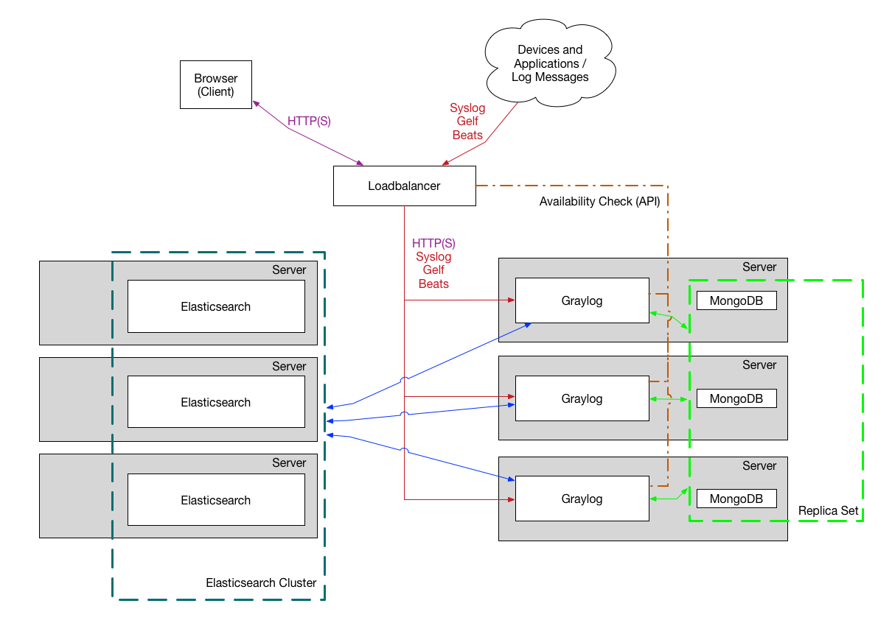

@title[Title]
## Graylog
##### Enterprise Log Management 

---

@title[Outline]
#### Outline
 
- Introduction |
- Architecture |
- Data Ingesting |

---

@title[Introduction]
##### Graylog is a centralized logging system
- Storing
- Exploration
- Alerting
- Reporting
 
and more...

---

@title[Architecture]

- MongoDB: storing meta information and configuration data
- Elasticsearch: responsible for log data storing
- Graylog-Server: the input/output engine and Web UI, on top of MongoDB and Elasticsearch.

+++

@title[Octocat De Los Muertos]
Small setup
 

+++

@title[Octocat De Los Muertos]
Multi-node setup
 

